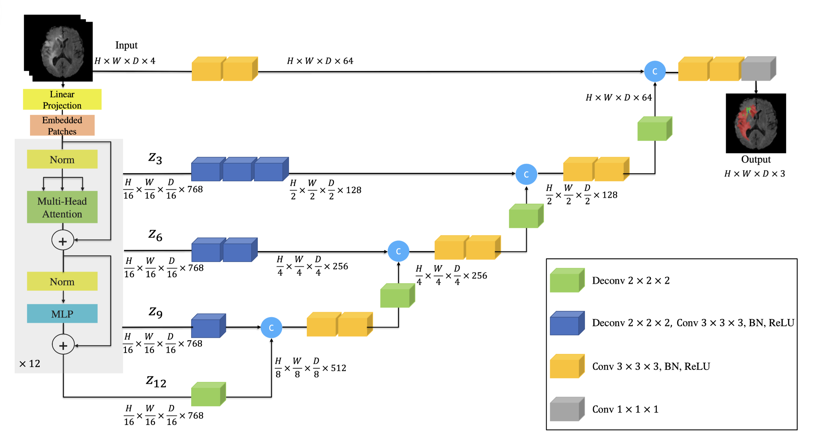
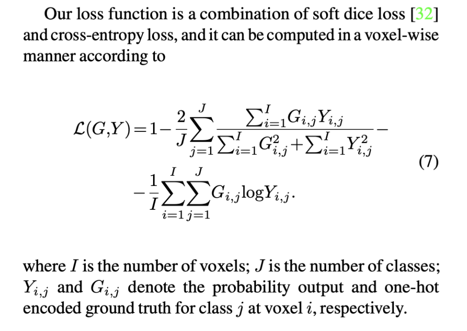

## Motivation
### disadvantage in traditional 3D CNN UNet:
performance in learning long-range dependencies is limited to their localized receptive fields [20, 35]. As a result, such a deficiency in capturing multi-scale information leads to sub-optimal segmentation of structures with variable shapes and scales (e.g. brain lesions with different sizes). 

(continue.) poor performance in learning global context and long-range spatial dependencies, which can severely impact the segmentation performance for challenging tasks

### advantage in transformer
In computer vision, using transformers as a backbone encoder is beneficial due to their great capability of modeling long-range dependencies and capturing global context [14, 4]

Also, Vision Transformer (ViT) [14] and its variants have shown excellent capabilities in learning pre-text tasks that can be transferred to down-stream applications [40, 6, 3]

## Main idea:

In particular, we reformulate the task of 3D segmentation as a 1D sequence-to-sequence prediction problem and use a transformer as the encoder to learn contextual information from the embedded input patches. The extracted representations from the transformer encoder are merged with the CNN-based decoder via skip connections at multiple resolutions to predict the segmentation outputs. Instead of using transformers in the decoder, our proposed framework uses a CNN-based decoder. This is due to the fact that transformers are unable to properly capture localized information, despite their great capability of learning global information.

## Method
$3 \mathrm{D} \text { input volume } \mathbf{x} \in \mathbb{R}^{H \times W \times D \times C}$
1. dividing it into flattened uniform non-overlapping patches $\mathbf{x}_v \in \mathbb{R}^{N \times\left(P^3 \cdot C\right)}$ where $(P, P, P)$ denotes the resolution of each patch and $N=(H \times W \times D) / P^3$ is the length of the sequence.
***My Question: If HWD is not divisible by P?***

2. linear layer to project the patches into a $K$ dimensional embedding space
add a 1D learnable positional embedding $\mathbf{E}_{\text {pos }} \in \mathbb{R}^{N \times K}$ to the projected patch embedding $\mathbf{E} \in \mathbb{R}^{\left(P^3 . C\right) \times K}$ according to
$$\mathbf{z}_0=\left[\mathbf{x}_v^1 \mathbf{E} ; \mathbf{x}_v^2 \mathbf{E} ; \ldots ; \mathbf{x}_v^N \mathbf{E}\right]+\mathbf{E}_{p o s}$$

3. multi-head self-attention (MSA) and MLP
Norm() denotes layer normalization
$$\mathbf{z}_i^{\prime} =\operatorname{MSA}\left(\operatorname{Norm}\left(\mathbf{z}_{i-1}\right)\right)+\mathbf{z}_{i-1}, \quad i=1 \ldots L$$
$$\mathbf{z}_i =\operatorname{MLP}\left(\operatorname{Norm}\left(\mathbf{z}_i^{\prime}\right)\right)+\mathbf{z}_i^{\prime}, \quad i=1 \ldots L$$

4. Loss function
